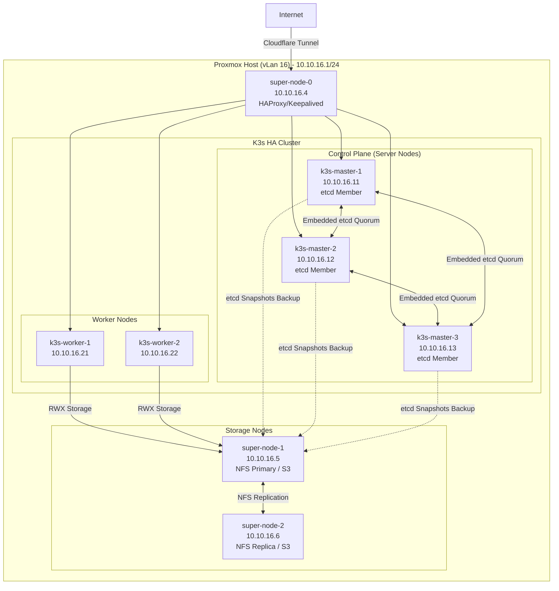
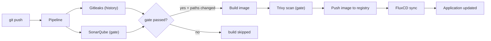

# K3s GitOps Platform on Proxmox

[](https://github.com/traipoap/gitops-platform/actions/workflows/pipeline.yml)


[](LICENSE)

A production-ready platform for building and managing a Kubernetes cluster on Proxmox. It automates the whole setup — from virtual machines to application deployment — using Infrastructure as Code (IaC), GitOps, CI/CD, monitoring, and security tools.

This repository shows a repeatable, declarative, and automated way to run a Kubernetes platform.

## Features

- Create virtual machines on Proxmox with Terraform
- Set up system requirements and tune the kernel with Ansible
- Install a K3s Kubernetes cluster (with high availability)
- Manage workloads with GitOps using FluxCD
- Deploy components with Kustomize and Helm
- Build and publish images with GitHub Actions
- Update the GitOps repo automatically when new images are built
- Monitor the cluster with Prometheus and Grafana
- View service mesh traffic with Istio and Kiali
- Collect and query logs with Vector and Quickwit
- S3-compatible object storage with Garage
- Automatic TLS certificates with cert-manager
- Security gates before build: Gitleaks secret scanning, SonarQube code quality, and Trivy image scanning block broken or vulnerable releases
- Cluster policy with Kyverno and in-cluster secrets with the External Secrets Operator

## Architecture Decisions

Key choices and the reason behind each one:

| # | Decision | Why |
|---|---|---|
| 1 | K3s instead of full Kubernetes | A single binary built for small VMs (1 vCPU / 2–8 GB). Low memory, built-in etcd, works with Helm and Gateway API. |
| 2 | HA with embedded etcd | No extra database to run. The first master starts the cluster; the others join with a shared token. |
| 3 | One "super-node" for LB + NFS + S3 | The lab has limited VMs, so edge services share one VM to save RAM and disks. |
| 4 | Terraform for VMs, Ansible for software | Terraform owns infrastructure state; Ansible owns software state. Both are repeatable from the repo. |
| 5 | Count-based scaling | Change three numbers to scale the cluster. Names, vm_id, and IPs are generated per role. |
| 6 | GitOps with FluxCD | All changes go through Git. Drift is fixed automatically and the history lives in git. |
| 7 | Istio with Gateway API | Standard ingress with mTLS and traffic policies. Kiali shows the traffic. |
| 8 | Two storage tiers: NFS + Garage | NFS for shared state, Garage for S3 objects. Both run where the data lives. |
| 9 | Clone from a template VM | Fast (~3 min) and consistent. Cloud-init only sets hostname, user, and IP. |
| 10 | Secrets outside git | Terraform reads tfvars; Ansible reads env vars. Secrets never enter the repo. |
| 11 | Vector + Quickwit for logs | A lightweight logging stack that fits the lab. |
| 12 | Proxmox VE as the hypervisor | A proven open-source KVM platform with a clean API that Terraform uses directly. |
| 13 | GitHub Actions + GHCR | CI lives in the repo. No self-hosted CI server to run. Images go to GHCR. |
| 14 | Security gate before build | Gitleaks + SonarQube must pass. A leaked secret or a bad image never reaches the registry. |
| 15 | Kyverno for policy | Cluster policy in plain YAML (no Rego). Enforces pod security and image rules. |
| 16 | External Secrets Operator | Secrets stay in a backend and sync into the cluster. The GitOps repo has no sensitive data. |

> These choices keep the platform simple to run on limited hardware, while using standard tools (Kubernetes API, Gateway API, S3, GitOps). The same repo can grow toward a production setup without a rewrite.

## Tech Stack

| Category | Tools |
|---|---|
| Infrastructure | Proxmox VE, Terraform, Ansible, NFS |
| Kubernetes | K3s, kubectl, Helm, Kustomize, FluxCD, Istio, cert-manager |
| CI/CD | GitHub Actions, Docker, GHCR |
| Security | Trivy, Gitleaks, SonarQube, Kyverno, External Secrets Operator |
| Observability | Prometheus, Grafana, Kiali, Vector, Quickwit |
| Storage | NFS, Garage (S3-compatible) |

## Lab Environment

The platform runs on a single Proxmox host.

| Resource | Specification |
|---|---|
| CPU | 4 x Intel Core i5-3470S @ 2.90GHz |
| RAM | 16 GB |
| Storage | 2 x 1 TB HDD, 1 x 500 GB HDD |
| Hypervisor | Proxmox VE 9.1.5 |

### VM Allocation

VMs are created from two variables — there are no per-VM definitions to maintain:

- `cluster_node_counts` — how many VMs per role (`super` / `master` / `worker`)
- `cluster_node_specs` — specs per role (vm_id base, vCPU, RAM, IP base, disks)

Node `N` (1-based) of a role gets name `<base>-N`, vm_id `<vm_id_base> + N - 1`, and IP `<ip_base> + N - 1`:

| Role | Name | vCPU | RAM | Disk | IP (vLan 16) |
|---|---|---:|---:|---:|---:|
| super | `super-node-N` | 1 | 2 GB | 32 GB + 100 GB | 10.10.16.4 + N−1 |
| master | `k3s-master-N` | 2 | 4 GB | 32 GB | 10.10.16.11 + N−1 |
| worker | `k3s-worker-N` | 2 | 8 GB | 32 GB | 10.10.16.21 + N−1 |

> The lab has limited resources. Workloads use resource requests/limits, and you can disable non-essential components to save memory.

### Network Topology



### Deployment Time

| Phase | Time |
|---|---|
| Terraform provision (VM creation) | ~3 min |
| Ansible prerequisites + K3s install | ~6 min |
| Istio + storage + S3 + FluxCD setup | ~4 min |
| First full reconciliation | ~25 min |
| **Total** | **~40 min** |

## Repository Structure

```
├── terraform/     # Proxmox VM provisioning
├── ansible/       # playbooks + roles (cluster setup, service mesh, storage)
├── backend/       # Go API (auth, search, export)
├── frontend/      # Astro dashboard
├── docker/        # Dockerfiles for backend and frontend
└── .github/       # CI/CD workflows
```

> Local-only files (gitignored, created at runtime): `.env` / `.env.example`, `backend/.env`, `backend/data/`, `frontend/.env`, `terraform/*.tfstate`, and `terraform/secrets.auto.tfvars`.

## Quickstart

### Prerequisites

| Tool | Minimum Version |
|---|---|
| Terraform | ≥ 1.5 |
| Ansible | ≥ 2.15 |
| kubectl | — |
| flux | ≥ 2.3 |
| helm | ≥ 3.12 |
| Proxmox VE | 8.x / 9.x, with a base VM template ready |

### 1. Clone the repository

```bash
git clone https://github.com/traipoap/gitops-platform.git
cd gitops-platform
```

### 2. Copy the example environment file

```bash
cp .env.example .env
```

### 3. Configure your values

Terraform secrets (`terraform/secrets.auto.tfvars`):

```hcl
proxmox_endpoint = "https://proxmox.xxx.xxx"
proxmox_username = "xxx@pam"
proxmox_password = "xxx"
proxmox_ssh_username = "xxx"

ssh_username = "xxx"
ssh_public_keys = [
  "ssh-ed25519 xxx xxx@xxx"
]

cluster_node_counts = {
  super  = 1
  master = 1
  worker = 1
}
```

Environment variables (`.env`):

```bash
# RPC secret between nodes
export RPC_SECRET="$(openssl rand -hex 32)"
# Admin token for the application backend
export ADMIN_TOKEN="$(openssl rand -base64 32)"
# Garage S3-compatible object storage credentials
export GARAGE_DEFAULT_ACCESS_KEY="GK$(openssl rand -hex 16)"
export GARAGE_DEFAULT_SECRET_KEY="$(openssl rand -hex 32)"
# GitHub PAT for FluxCD bootstrap
export APP_GIT_SECRET="xxx"
```

### 4. Provision the infrastructure

```bash
cd terraform
terraform init
terraform plan
terraform apply
```

### 5. Run the Ansible playbooks

> **HA control plane:** set `cluster_node_counts.master = 3` (or more) before `terraform apply`. The first master starts the K3s cluster; the rest join automatically, and the workers join as agents.

```bash
source .env
cd ansible
ansible-playbook -i inventory/hosts playbooks/00-prerequisites.yml
ansible-playbook -i inventory/hosts playbooks/01-cluster-setup.yml
ansible-playbook -i inventory/hosts playbooks/02-servicemesh.yml
ansible-playbook -i inventory/hosts playbooks/03-storage-networking.yml
ansible-playbook -i inventory/hosts playbooks/04-garage-deploy.yml
ansible-playbook -i inventory/hosts playbooks/05-gitops-bootstrap.yml
```

> If the environment variables are set, Ansible uses them and skips interactive prompts. If they are not set, Ansible asks for input instead.

## GitOps Workflow

FluxCD watches the Git repository and keeps the cluster in sync using `GitRepository`, `Kustomization`, `HelmRepository`, and `HelmRelease`.

Bootstrap FluxCD:

```bash
flux bootstrap github \
      --owner=traipoap \
      --repository=fleet-infra \
      --branch=main \
      --path=./clusters/staging \
      --personal
```

Check status:

```bash
flux get all -A
kubectl get nodes
kubectl get pods -A
```

## CI/CD Pipeline

The pipeline uses GitHub Actions (`.github/workflows/pipeline.yml`). On each push:

1. **Security gate** — Gitleaks (secret scan of the full history) + SonarQube (code quality and security analysis). If either fails, the build is skipped entirely.
2. **Build** — only for services whose paths changed.
3. **Trivy scan** — vulnerability scan **before** push. CRITICAL/HIGH blocks the push, and the SARIF report lands in the GitHub Security tab.
4. **Push** — the image goes to GHCR (private registry, fine-grained PAT — no hardcoded credentials).
5. **Deploy** — FluxCD detects the new tag and updates the cluster.

> The image-tag update in the GitOps repo is handled by FluxCD; the pipeline stops at a verified, pushed image.

Example workflow:



### Repository secrets and variables

| Type | Name | Used by |
|---|---|---|
| Variable | `SONAR_HOST_URL` | SonarQube job |
| Secret | `SONAR_TOKEN` | SonarQube job |
| Secret | `TOKEN_REGISTRY` | build & Trivy steps |

> All secrets live in GitHub **Settings → Secrets and variables → Actions**. Nothing is hardcoded in the workflow files. The SonarQube project key is not a secret, so it lives in [`sonar-project.properties`](sonar-project.properties).

## Observability

**Prometheus** (metrics):

```bash
kubectl -n istio-system port-forward svc/prometheus 9090:9090
```
Open <http://localhost:9090>

**Grafana** (dashboards):

```bash
kubectl -n istio-system port-forward svc/grafana 3000:3000
```
Open <http://localhost:3000>

**Kiali** (service mesh traffic):

```bash
kubectl -n istio-system port-forward svc/kiali 20001:20001
```
Open <http://localhost:20001>

**Quickwit** (logs, collected by Vector):

```bash
kubectl -n logging get pods
kubectl -n logging logs -l app.kubernetes.io/name=vector
kubectl -n logging port-forward svc/quickwit-searcher 7280:7280
```
Open <http://localhost:7280>

## Storage

### NFS

NFS provides persistent storage for stateful workloads.

**Example StorageClass:**

```yaml
apiVersion: storage.k8s.io/v1
kind: StorageClass
metadata:
  name: nfs-subdir-external-provisioner
provisioner: cluster.local/nfs-subdir-external-provisioner
parameters:
  server: 10.10.16.4
  path: /nfs
reclaimPolicy: Delete
volumeBindingMode: Immediate
```

### Garage

Garage provides S3-compatible object storage. Use it for backups, application assets, or a registry backend.

## Security

**In place:**

- TLS certificates managed by cert-manager
- Declarative configuration in Git
- Secrets kept out of Git — the External Secrets Operator syncs them into the cluster
- Namespace isolation and RBAC for access control
- Pod security enforced with Kyverno policies (plain YAML, no Rego)
- Container image scanning with Trivy in CI (CRITICAL/HIGH gate)
- Secret scanning with Gitleaks and code quality with SonarQube before every build
- Private registry authentication (GHCR fine-grained PAT)
- Automated reconciliation to fix configuration drift

**Planned improvements:**

- SOPS + age for secret encryption
- NetworkPolicies (default-deny posture)
- Signed container images (cosign)

## Backup and Restore

Recommended targets: etcd snapshots, Kubernetes manifests, persistent volumes, the GitOps repo, secrets, NFS data, and Garage data.

Tools to consider: Velero, Kopia, Restic, and native etcd snapshots.

> Detailed procedures are planned in [docs/backup-restore.md](docs/backup-restore.md) (see Roadmap).

## Troubleshooting

**Nodes:**

```bash
kubectl get nodes -o wide
kubectl describe node <node-name>
```

**Pods:**

```bash
kubectl get pods -A
kubectl describe pod <pod-name> -n <namespace>
kubectl logs <pod-name> -n <namespace>
kubectl logs <pod-name> -n <namespace> --previous
```

**FluxCD:**

```bash
flux get all -A
flux get kustomizations -A
flux reconcile source git flux-system -n flux-system
flux reconcile kustomization <name> -n <namespace> --with-source
```

**Helm:**

```bash
kubectl describe helmrelease <name> -n <namespace>
kubectl get events -n <namespace> --sort-by=.metadata.creationTimestamp
```

## Results / Impact

- Cut infrastructure provisioning time from several hours to about 40 minutes
- Removed manual Kubernetes deployment steps using GitOps
- Improved environment consistency by declaring all workloads in Git
- Made cluster rebuilds repeatable from Git and automation scripts
- Improved observability with Prometheus, Grafana, Kiali, and centralized logging
- Reduced configuration drift through continuous reconciliation by FluxCD

## Lessons Learned

- GitOps improves consistency and auditability compared to manual `kubectl apply`
- Infrastructure automation requires careful handling of secrets and state files
- Observability should be installed early, not after problems occur
- Backup and restore testing matters as much as deployment automation
- Troubleshooting Kubernetes requires solid Linux and networking fundamentals
- Ansible group names must use underscores (`k3s_masters`), not hyphens — hyphens trigger warnings and unpredictable behavior in `hostvars`/`groups`

## Roadmap

**Done — CI/CD security baseline**
- Security gate before build (Gitleaks + SonarQube)
- Trivy scan before push (CRITICAL/HIGH gate + SARIF in the Security tab)
- Path-filtered builds (only changed services rebuild)
- No hardcoded secrets in workflows

**Next — DevSecOps engineering**
- Reliability & disaster recovery: Velero backup with periodic restore testing, a DR runbook with measured RTO/RPO, and Ceph to replace NFS
- Policy as code: Kyverno policies (required labels, resource quotas, no privileged containers), default-deny NetworkPolicies, and keeping secrets fully out of the GitOps repo with the External Secrets Operator
- Multi-environment promotion: dev → staging → production with per-environment gates
- Supply chain: OIDC (workload identity) for GHCR push, a manifest validation gate (kubeconform + `kubectl apply --dry-run=server`), cosign image signing with Flux verification, and SBOM (syft) published as build artifacts
- Observability: end-to-end tracing, Prometheus alert rules, and SLO dashboards for the platform itself

## Contributing

Contributions are welcome!
- Open an [issue](https://github.com/traipoap/gitops-platform/issues) for bugs or ideas
- Submit a [pull request](https://github.com/traipoap/gitops-platform/pulls) for improvements

Please keep changes consistent with the existing style and update the documentation.

## License

This project is licensed under the Apache 2.0 license — see the [LICENSE](LICENSE) file.
