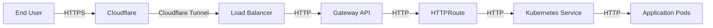
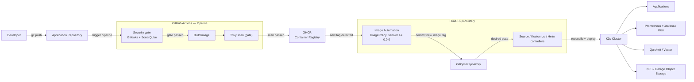
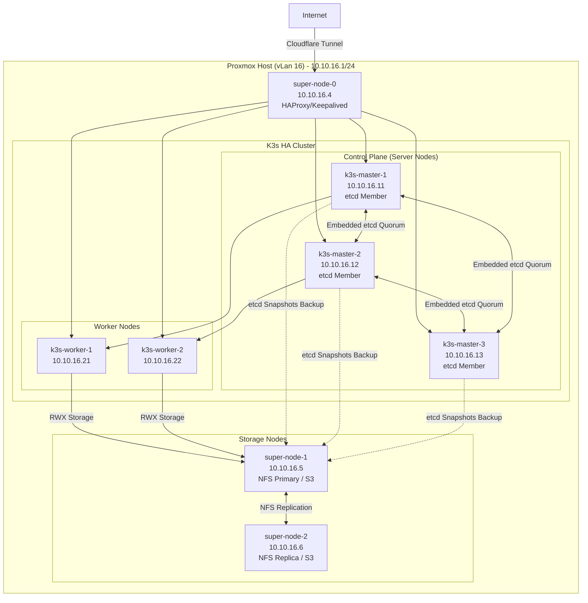
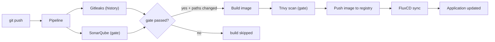

# K3s GitOps Platform on Proxmox

[](https://github.com/traipoap/gitops-platform/actions/workflows/pipeline.yml)


[](LICENSE)

A Ready-production / portfolio platform for provisioning and managing a Kubernetes cluster using Infrastructure as Code, GitOps, CI/CD, observability, and security.

This project demonstrates how to build a repeatable, declarative, and automated Kubernetes platform from bare-metal/virtual infrastructure to application deployment.

---

## Architecture Decisions

Key decisions that shaped this platform, and the reasoning behind them.

| # | Decision | Alternatives considered | Rationale |
|---|---|---|---|
| 1 | **K3s instead of upstream Kubernetes** | kubeadm + full K8s, MicroK8s, k0s | Single-binary distribution sized for a resource-constrained lab (1 vCPU / 2–8 GB VMs): built-in etcd, containerd, and low memory overhead. Ecosystem-compatible (Helm, operators, Gateway API all work unchanged). |
| 2 | **HA via embedded etcd, token-based master join** | External DB (Postgres/MySQL) for the control plane | No extra stateful service to operate. The first master initializes the cluster and writes a node token; `01-cluster-setup.yml` propagates that token so additional masters join automatically (`K3S_URL` + `K3S_TOKEN`). An external DB remains a possible hardening step if the control plane grows. |
| 3 | **Single "super-node" hosting LB + NFS + S3 + Vector** | One VM per infrastructure service | The lab's hardware caps total VMs, so stateful/edge services share one VM to save RAM and disks. Trade-off: it is a single point of failure — mitigated by Garage's multi-node replication option and NFS backups (see Backup section). |
| 4 | **Terraform for VM lifecycle, Ansible for software** | Pure Ansible (create VMs + config), Proxmox CLI scripts | Clean separation of concerns: Terraform owns *infrastructure state* (clone-from-template, disks, IPs, cloud-init) with plan/apply/destroy; Ansible owns *desired software state* (idempotent roles). Both are reproducible from the repo. |
| 5 | **Count-driven node scaling (`cluster_node_counts` + `cluster_node_specs`)** | One explicit map entry per VM | Scales the cluster by changing three numbers instead of duplicating per-VM blocks. vm_id / IP / hostname are derived per role, so any count stays consistent, and a duplicate-key class of HCL errors is impossible. |
| 6 | **GitOps with FluxCD over imperative `kubectl`** | Manual `kubectl apply`, Argo CD | All cluster changes flow through the GitOps repository; GitHub Actions pushes image tags and Flux reconciles. State drift is self-healing and the audit trail lives in git. |
| 7 | **Istio with Gateway API, K3s Traefik disabled** | K3s built-in Traefik ingress, standalone Ingress controller | Standardizes ingress on Gateway API + HTTPRoute for mTLS, traffic policies, and Kiali visibility. `--disable=traefik` avoids two ingress controllers fighting over routes. |
| 8 | **Two-tier storage: NFS (shared state) + Garage (objects)** | Ceph, longhorn, hostPath | NFS StorageClass covers stateful pods with minimal complexity; Garage gives S3-compatible object storage with replication. Both run where the data already lives (super-node), avoiding cross-host disk dependencies. |
| 9 | **Template-clone provisioning (vm 2000, incremental clone)** | Full VM creation from ISO each time | Cloning a preinstalled base image makes provisioning fast (~3 min) and uniform; cloud-init snippets (generated by Terraform) only inject identity — hostname, user, SSH keys, IP. |
| 10 | **Ansible group names with underscores (`k3s_masters`, …)** | Hyphenated group names | Hyphens are invalid in Ansible group names (warning + unpredictable behavior in `hostvars`/`groups`). Roles keep hyphen names (`load-balance`) — those are valid and unaffected. |
| 11 | **Secrets via `secrets.auto.tfvars` (git-ignored) + `.env` for Ansible** | Hardcoded values, Vault | Sensitive material never enters git. Terraform reads tfvars; Ansible reads env vars in Option A, skipping interactive prompts in CI. |
| 12 | **Vector → Quickwit for logging, Prometheus/Grafana/Kiali for metrics/traces** | Loki/ELK, Jaeger | Lightweight, lab-friendly stack: single-agent (Vector) ships logs; Quickwit handles scale without a full Elasticsearch cluster; Kiali complements Istio for service-mesh observability. |

> These decisions favor **operational simplicity within the lab's hardware limits** while staying on standards-based components (Kubernetes API, Gateway API, S3, GitOps), so the same repository can scale toward a production-style topology without a rewrite.


## Table of Contents
- [Overview](#-overview)
- [Lab Environment](#lab-environment)
- [Architecture](#architecture)
- [Network Topology Diagram](#network-topology-diagram)
- [Deployment Time Estimates](#deployment-time-estimates)
- [Features](#features)
- [Prerequisites](#prerequisites)
- [Tech Stack](#tech-stack)
- [Repository Structure](#repository-structure)
- [Quickstart](#quickstart)
- [GitOps Workflow](#gitops-workflow)
- [CI/CD Pipeline](#cicd-pipeline)
- [Observability](#observability)
- [Storage](#storage)
- [Security](#security)
- [Backup and Restore](#backup-and-restore)
- [Troubleshooting](#troubleshooting)
- [Results / Impact](#results--impact)
- [Lessons Learned](#lessons-learned)
- [Roadmap](#roadmap)
- [Contributing](#contributing)
- [License](#license)

---

## 🏗 Overview

This project automates the deployment and management of a K3s Kubernetes cluster on Proxmox virtual machines using Terraform and Ansible.

The cluster is managed using a GitOps workflow with FluxCD. All infrastructure and Kubernetes workloads are declared in Git, and FluxCD continuously reconciles the cluster state with the desired state defined in the repository.

The platform includes:

- Automated VM and infrastructure provisioning
- Automated Kubernetes cluster installation
- GitOps-based application and infrastructure management
- CI/CD pipeline using GitHub Actions
- Monitoring and logging stack
- Service mesh visibility with Istio and Kiali
- Object storage using Garage
- TLS automation using cert-manager

---

## Lab Environment

This platform is deployed on a single-node Proxmox lab environment.

| Resource | Specification |
|---|---:|
| CPU | 4 x Intel(R) Core(TM) i5-3470S CPU @ 2.90GHz (1 Socket) |
| RAM | 16 GB |
| Storage | 2 x 1 TB HDD, 1 x 500 GB HDD |
| Hypervisor | Proxmox VE 9.1.5 |

### VM Allocation

VMs are created **dynamically** from two Terraform variables — there are no per-VM definitions to maintain:

- `cluster_node_counts` — how many VMs to create per role (`super` / `master` / `worker`)
- `cluster_node_specs` — per-role specs (vm_id base, vCPU, RAM, IP base, disks)

Node `N` (1-based) of a role gets name `<name-base>-N`, vm_id `<vm_id_base> + N - 1`, and IP `<ip_base> + N - 1`:

| Role | Name pattern | vCPU | RAM | Disk | IP (vLan 16) |
|---|---|---:|---:|---:|---:|
| super | `super-node-N` | 1 | 2 GB | 32 GB + 100 GB | 10.10.16.4 + N−1 |
| master | `k3s-master-N` | 1 | 4 GB | 32 GB | 10.10.16.11 + N−1 |
| worker | `k3s-worker-N` | 1 | 8 GB | 32 GB | 10.10.16.21 + N−1 |

Example scaled cluster (`cluster_node_counts = { super = 2, master = 2, worker = 2 }`):

| VM | Role | Network |
|---|---|---|
| super-node-1, super-node-2 | LB / NFS / S3 | 10.10.16.4, 10.10.16.5 |
| k3s-master-1, k3s-master-2 | K3s control plane (HA) | 10.10.16.11, 10.10.16.12 |
| k3s-worker-1, k3s-worker-2 | K3s worker nodes | 10.10.16.21, 10.10.16.22 |

> Note: The lab environment has limited resources. Workloads are configured with resource requests/limits, and non-essential components can be disabled to reduce memory usage.


### Traffic Flow


---

## Architecture



---

## Network Topology Diagram



---

## Deployment Time Estimates

| Phase | Estimated Time |
|---|---|
| Terraform provision (VM creation) | ~3 min |
| Ansible prerequisites + K3s install | ~6 min |
| Istio install | ~1 min |
| Storage networking setup | ~1 min |
| S3 bucket setup | ~1 min |
| FluxCD bootstrap | ~1 min |
| First full reconciliation | ~6 min |
| **Total** | **~20-25 min** |

---

## Features
- Provision virtual machines on Proxmox using Infrastructure as Code
- Automate system prerequisites and kernel tuning with Ansible
- Install and configure a K3s Kubernetes cluster
- Manage Kubernetes workloads using GitOps with FluxCD
- Deploy infrastructure components using Kustomize and Helm
- Build and publish container images using GitHub Actions
- Automatically update GitOps repository when new images are built
- Monitor cluster and workloads with Prometheus and Grafana
- Visualize service mesh traffic with Kiali
- Collect and query logs using Vector and Quickwit
- Provide S3-compatible object storage using Garage
- Automate TLS certificates with cert-manager
- Store cluster configuration declaratively in Git

---

## Prerequisites

Before you begin, ensure the following tools are installed on your workstation:

| Tool | Minimum Version | Install Command |
|---|---|---|
| Terraform | ≥ 1.5 | `brew install hashicorp/tap/terraform` |
| Ansible | ≥ 2.15 | `pip install ansible-core` |
| kubectl | — | `kubectl version --client` |
| flux | ≥ 2.3 | `brew install fluxcd/tap/flux` |
| helm | ≥ 3.12 | `brew install helm` |
| Proxmox Terraform Provider | latest | Configured in `terraform/provider.tf` |

### Version Compatibility

| Component | Version |
|---|---|
| K3s | v1.31.x |
| FluxCD | ≥ 2.3 |
| Istio | 1.24.x |
| Proxmox VE | 8.x / 9.x |
| Terraform | ≥ 1.5 |
| Ansible | ≥ 2.15 |

---

## Tech Stack
### Infrastructure
- Proxmox VE
- Terraform
- Ansible
- Linux
- NFS
### Kubernetes
- CRUN Runtime
- Youki Runtime
- K3s
- kubectl
- Helm
- Kustomize
- FluxCD
- Istio
- cert-manager
### CI/CD
- GitHub Actions
- Docker
- Container Registry
### Observability
- Prometheus
- Grafana
- Kiali
- Vector
- Quickwit

### Storage
- NFS
- Garage Object Storage, S3-compatible

---

## Repository Structure

```
.
├── .github
│   └── workflows
│       ├── build-and-push.yml
│       └── pipeline.yml
├── ansible
│   ├── ansible.cfg
│   ├── inventory
│   │   └── hosts
│   ├── playbooks
│   │   ├── 00-prerequisites.yml
│   │   ├── 01-cluster-setup.yml
│   │   ├── 02-servicemesh.yml
│   │   ├── 03-storage-networking.yml
│   │   ├── 04-garage-deploy.yml
│   │   ├── 05-gitops-bootstrap.yml
│   │   └── quickstart.sh
│   └── roles
│       ├── common
│       │   └── tasks
│       │       └── main.yml
│       ├── fluxcd
│       │   └── tasks
│       │       └── main.yml
│       ├── garage
│       │   ├── tasks
│       │   │   └── main.yml
│       │   └── templates
│       │       ├── garage.toml.j2
│       │       └── systemd
│       │           └── garage.service.j2
│       ├── istio
│       │   └── tasks
│       │       └── main.yml
│       ├── k3s-agent
│       │   └── tasks
│       │       └── main.yml
│       ├── k3s-server
│       │   └── tasks
│       │       └── main.yml
│       ├── load-balance
│       │   ├── tasks
│       │   │   └── main.yml
│       │   └── templates
│       │       └── haproxy.cfg.j2
│       ├── nfs
│       │   ├── tasks
│       │   │   └── main.yml
│       │   └── templates
│       │       └── exports.j2
│       └── runtime
│           └── tasks
│               └── main.yml
├── backend
│   ├── config
│   │   ├── config.go
│   │   └── jwt.go
│   ├── controllers
│   │   ├── export_controller.go
│   │   ├── exports_list_controller.go
│   │   ├── protected_controller.go
│   │   ├── register_controller.go
│   │   ├── search_controller.go
│   │   └── signin_controller.go
│   ├── go.mod
│   ├── go.sum
│   ├── main.go
│   ├── middleware
│   │   └── jwt.go
│   ├── models
│   │   ├── export.go
│   │   ├── jwt.go
│   │   ├── register.go
│   │   └── search.go
│   ├── routers
│   │   └── routers.go
│   └── services
│       ├── download_service.go
│       ├── export_service.go
│       ├── jwt.go
│       └── quickwit_client.go
├── docker
│   ├── backend
│   │   └── Dockerfile
│   └── frontend
│       └── Dockerfile
├── frontend
│   ├── .vscode
│   │   ├── extensions.json
│   │   └── launch.json
│   ├── astro.config.mjs
│   ├── package.json
│   ├── package-lock.json
│   ├── public
│   │   ├── favicon.ico
│   │   └── favicon.svg
│   ├── src
│   │   ├── assets
│   │   │   ├── astro.svg
│   │   │   ├── background.svg
│   │   │   └── logout.svg
│   │   ├── components
│   │   │   └── Welcome.astro
│   │   ├── layouts
│   │   │   └── Layout.astro
│   │   ├── pages
│   │   │   ├── 404.astro
│   │   │   ├── dashboard.astro
│   │   │   ├── index.astro
│   │   │   ├── signin.astro
│   │   │   └── signup.astro
│   │   ├── scripts
│   │   │   └── dashboard.js
│   │   └── styles
│   │       ├── logs.css
│   │       ├── main.css
│   │       ├── signin.css
│   │       └── signup.css
│   └── tsconfig.json
├── terraform
│   ├── .terraform.lock.hcl
│   ├── backend.tf
│   ├── locals.tf
│   ├── main.tf
│   ├── provider.tf
│   ├── templates
│   │   ├── haproxy.tpl
│   │   └── hosts.tpl
│   └── variables.tf
├── .dockerignore
├── .gitignore
├── LICENSE
├── README.md
└── start-app.sh
```

> **Local-only files (gitignored, generated at runtime):** `.env` / `.env.example` (root), `backend/.env`, `backend/data/users.db`, `backend/exports/` (exported CSVs + `.hash_registry.jsonl`), `frontend/.env`, `terraform/*.tfstate`, `terraform/secrets.auto.tfvars`.

---

## Quickstart

### Prerequisites Checklist

Before running the setup, ensure you have completed the following:

- [ ] Terraform ≥ 1.5 installed locally
- [ ] Ansible ≥ 2.15 installed locally
- [ ] kubectl and flux CLI installed
- [ ] Proxmox VE 9.1.5 server with VMs configured
- [ ] GitHub repository created with GitHub Actions enabled
- [ ] `.env` file created with required environment variables
- [ ] SSH access configured to Proxmox VMs

### Clone the repository
```bash
git clone https://github.com/traipoap/gitops-platform.git
cd gitops-platform
```

### Copy the example environment file
```bash
cp .env.example .env
```

### Edit .env with your environment values
```bash
# Proxmox API token
cat >> terraform/secrets.auto.tfvars <<'EOF'
proxmox_endpoint = "https://proxmox.xxx.xxx"
proxmox_username = "xxx@pam"
proxmox_password = "xxx"
proxmox_ssh_username = "xxx"

ssh_username = "xxx"
ssh_public_keys = [
  "ssh-ed25519 xxx xxx@xxx-MacBook-Air.local",
  "ssh-ed25519 xxx xxx@xxx-desktop",
  "ssh-ed25519 xxx xxx@local"
]
cluster_node_counts = {
  super  = 1
  master = 1
  worker = 1
}
EOF

# RPC secret between nodes 
export RPC_SECRET="$(openssl rand -hex 32)"
# Admin token for the application backend 
export ADMIN_TOKEN="$(openssl rand -base64 32)"
# Garage S3-compatible object storage credentials
export GARAGE_DEFAULT_ACCESS_KEY="GK$(openssl rand -hex 16)"
export GARAGE_DEFAULT_SECRET_KEY="$(openssl rand -hex 32)"
# GitHub PAT for GitOps repository access (FluxCD bootstrap) GitHub PAT
export APP_GIT_SECRET="xxx"
```

### Provision infrastructure
```bash
cd terraform
terraform init
terraform login
terraform plan
terraform apply
```

### Run Ansible playbooks
> **Multi-master (HA):** `01-cluster-setup.yml` supports more than one control plane node. The first master in the inventory initializes the K3s cluster; every additional master then joins as an HA control plane replica (K3s embedded etcd), and workers join as agents. To get an HA control plane, set `cluster_node_counts.master = 3` (or more) before `terraform apply` — Ansible handles the rest automatically.

#### Option A: Environment variables (recommended — no interactive prompts)
**bash / zsh:**
```bash
source .env
cd ansible
ansible-playbook -i inventory/hosts playbooks/00-prerequisites.yml
ansible-playbook -i inventory/hosts playbooks/01-cluster-setup.yml
ansible-playbook -i inventory/hosts playbooks/02-servicemesh.yml
ansible-playbook -i inventory/hosts playbooks/03-storage-networking.yml
ansible-playbook -i inventory/hosts playbooks/04-garage-deploy.yml
ansible-playbook -i inventory/hosts playbooks/05-gitops-bootstrap.yml
```
> When environment variables are set, Ansible uses them directly and skips interactive prompts.

#### Option B: Interactive mode (no env vars — prompts for input)
```bash
cd ansible
ansible-playbook -i inventory/hosts playbooks/00-prerequisites.yml
ansible-playbook -i inventory/hosts playbooks/01-cluster-setup.yml
ansible-playbook -i inventory/hosts playbooks/02-servicemesh.yml
ansible-playbook -i inventory/hosts playbooks/03-storage-networking.yml
ansible-playbook -i inventory/hosts playbooks/04-garage-deploy.yml # Prompts for garage credentials (blank to auto-generate)
ansible-playbook -i inventory/hosts playbooks/05-gitops-bootstrap.yml # Prompts for FluxCD and GitHub PAT
```

---

## GitOps Workflow
This project uses FluxCD as the GitOps operator.
FluxCD watches this Git repository and reconciles the cluster state using:
- GitRepository
- Kustomization
- HelmRepository
- HelmRelease

Bootstrap FluxCD:
```bash
flux bootstrap github \
      --owner=traipoap \
      --repository=fleet-infra \
      --branch=main \
      --path=./clusters/staging \
      --personal
```

Check FluxCD status:
```bash
flux get all -A
```

Check Kubernetes resources:
```bash
kubectl get nodes
kubectl get pods -A
kubectl get gitrepositories -A
kubectl get kustomizations -A
kubectl get helmreleases -A
```
---

## CI/CD Pipeline
The CI/CD pipeline uses GitHub Actions.

When code is pushed to the repository, a single pipeline (`.github/workflows/pipeline.yml`) runs:
1. **Security gate** (every push / PR): Gitleaks secret scan of the full history + SonarQube code quality & security analysis
2. **Per-service build** — only for services whose paths changed, **and only if the security gate passed** (a failing Gitleaks or SonarQube job skips the builds entirely)
3. Build the Docker image
4. Scan the image with **Trivy** **before** pushing — CRITICAL/HIGH gate, so vulnerable images never reach the registry (SARIF uploaded to the Security tab)
5. Push the image to a container registry (GHCR)
6. FluxCD detects the new tag and deploys it

> The GitOps repository image-tag update is handled by the FluxCD bootstrap configuration in the GitOps repo; the pipeline itself stops at a verified, pushed image.

### Required repository secrets and variables

| Type | Name | Example value | Used by |
|---|---|---|---|
| Variable | `SONAR_HOST_URL` | `http://10.10.16.4:9000` | SonarQube job |
| Secret | `SONAR_TOKEN` | `sonarqube_…` | SonarQube job |
| Secret | `TOKEN_REGISTRY` | GHCR fine-grained PAT | build & Trivy steps |

> Server address and credentials come from **Settings → Secrets and variables → Actions** — no IP, token, or secret is hardcoded in any workflow file. The SonarQube **project key** is not a secret, so it lives in [`sonar-project.properties`](sonar-project.properties) at the repo root (it must match a project that exists on your SonarQube server).

### Example workflow


---

## Observability
### Prometheus
Prometheus is used to collect metrics from the cluster and workloads.

**Access locally:**
```bash
kubectl -n istio-system port-forward svc/prometheus-server 9090:9090
```
Open: <http://localhost:9090>

### Grafana
Grafana is used for dashboards and visualization.

**Access locally:**
```bash
kubectl -n istio-system port-forward svc/grafana 3000:3000
```
Open: <http://localhost:3000>

### Kiali
Kiali provides visibility into Istio service mesh traffic.

**Access locally:**
```bash
kubectl -n istio-system port-forward svc/kiali 20001:20001
```
Open: <http://localhost:20001>

### Logging
Logs are collected using Vector and stored/queryable in Quickwit.

**View log pods:**
```bash
kubectl -n lumina get pods
kubectl -n lumina logs -l app.kubernetes.io/name=vector
```
**Access Quickwit UI:**
```bash
kubectl -n lumina port-forward svc/quickwit-searcher 7280:7280
```
Open: <http://localhost:7280>

---

## Storage
### NFS
NFS is used for persistent storage in this lab environment.

**Example StorageClass:**
```yaml
apiVersion: storage.k8s.io/v1
kind: StorageClass
metadata:
  name: nfs-subdir-external-provisioner
provisioner: cluster.local/nfs-subdir-external-provisioner
parameters:
  server: 10.10.16.4
  path: /nfs
reclaimPolicy: Delete
volumeBindingMode: Immediate
```

### Garage Object Storage
Garage provides S3-compatible object storage.

**Example use cases:**
- Backup storage
- Application assets
- Registry storage backend
- S3-compatible testing

---

## Security
### Implemented practices
- TLS certificates managed by cert-manager
- Declarative configuration managed through Git
- Secrets separated from application manifests
- Namespace isolation
- RBAC for access control
- Pod security best practices
- Automated reconciliation to reduce configuration drift
- External Secrets Operator
- Container image scanning (Trivy in CI)
- Private registry authentication
- Kyverno policies enforced

### Recommended additional improvements
- SOPS + age for secret encryption
- NetworkPolicies
- Signed container images

---

## Backup and Restore
### Recommended backup targets
- etcd snapshots
- Kubernetes resource manifests
- Persistent volumes
- GitOps repository
- Secrets
- NFS data
- Garage object storage data

### Example tools
- Velero
- Kopia
- Restic
- etcd snapshot
- Longhorn snapshots, if using Longhorn

> 📝 Detailed backup and restore procedures are documented in [docs/backup-restore.md](docs/backup-restore.md). If this file does not exist yet, it is planned as part of the Roadmap.

---

## Troubleshooting
Check node status
```
kubectl get nodes -o wide
kubectl describe node <node-name>
```

Check pod status
```
kubectl get pods -A
kubectl describe pod <pod-name> -n <namespace>
kubectl logs <pod-name> -n <namespace>
kubectl logs <pod-name> -n <namespace> --previous
```

Check FluxCD status
```
flux get all -A
flux get kustomizations -A
flux get helmreleases -A
```

Force FluxCD reconciliation
```
flux reconcile source git flux-system -n flux-system
flux reconcile kustomization <name> -n <namespace> --with-source
```

Check HelmRelease status
```
kubectl describe helmrelease <name> -n <namespace>
kubectl get events -n <namespace> --sort-by=.metadata.creationTimestamp
```

---

## Results / Impact
- Reduced infrastructure provisioning time from several hours to approximately 20 minutes
- Eliminated manual Kubernetes deployment steps using GitOps
- Improved environment consistency by defining all workloads declaratively
- Enabled repeatable cluster rebuild from Git and automation scripts
- Improved observability using Prometheus, Grafana, Kiali, and centralized logging
- Reduced configuration drift through continuous reconciliation by FluxCD

---

## Lessons Learned
- GitOps improves consistency and auditability compared to manual kubectl apply
- Infrastructure automation requires careful handling of secrets and state files
- Observability should be installed early, not after problems occur
- Backup and restore testing is as important as deployment automation
- Kubernetes troubleshooting requires strong Linux and networking fundamentals

---

## Roadmap

### ✅ Completed — CI/CD security baseline
- Security gate before build: Gitleaks (secret scan of full history) + SonarQube (quality gate — fail = no build)
- Trivy image vulnerability scan **before** push to GHCR (CRITICAL/HIGH gate + SARIF in Security tab)
- Path-filtered builds — only changed services are rebuilt
- All IPs/tokens centralized in Actions Variables & Secrets — nothing hardcoded in workflows

### Next — DevOps Engineering

**Reliability & disaster recovery**
- Velero backup with periodic **restore testing** (backup you haven't restored is not a backup)
- DR runbook with **measured RTO/RPO** for the K3s cluster + Quickwit data
- Ceph to replace NFS for production-grade, replicated storage

**GitOps maturity & policy-as-code**
- Kyverno policy enforcement (required labels, resource quotas, disallow privileged containers)
- NetworkPolicies for namespace isolation (default-deny posture)
- External Secrets Operator — keep secrets **out of the GitOps repo** entirely
- Multi-environment promotion: dev → staging → production with stacked GitOps configs and per-env gate

**Pipeline & supply chain**
- OIDC (workload identity) for GHCR push — eliminate the long-lived registry PAT
- Kubernetes manifest validation as a pipeline gate (kubeconform + `kubectl apply --dry-run=server`)
- Image signing with cosign + Flux verification, and SBOM (syft) published as build artifacts
- OpenTelemetry end-to-end tracing + Prometheus alert rules and SLO dashboards for the platform itself

---

## Contributing
Contributions are welcome! Please feel free to:

- Open an [issue](https://github.com/traipoap/gitops-platform/issues) for bugs or feature requests
- Submit a [pull request](https://github.com/traipoap/gitops-platform/pulls) for improvements

When contributing, please ensure your changes follow the existing style and include updated documentation.

---

## License

This project is licensed under the Apache 2.0 license – see the [LICENSE](LICENSE) file for details.
