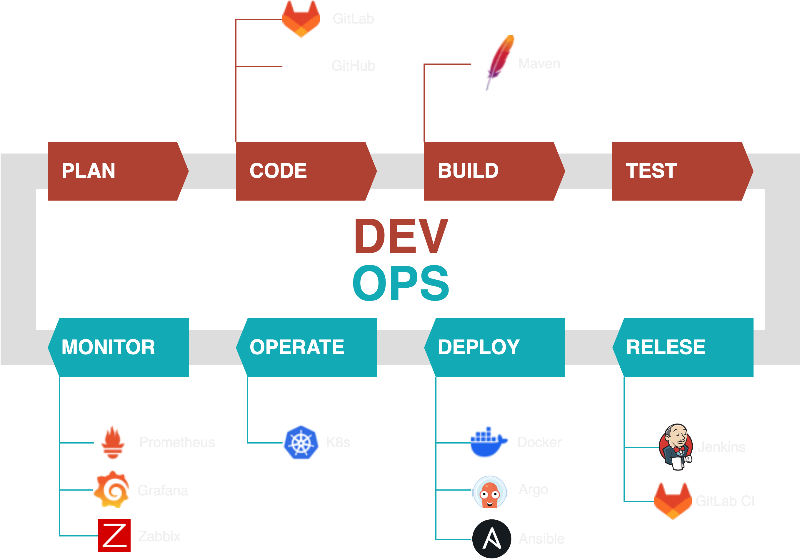

Hi My name is Traipoap.
================================================================================================================================

Network administrator.
---------------------

I've been Learning to deliver high quality software.

* 🌍  I'm based in Nonthaburi, Thailand
* ✉️  You can contact me at [traipoap@hotmail.com](mailto:traipoap@hotmail.com)

### Skills

<a href="https://www.docker.com/" target="_blank" rel="noreferrer"></a>

### Socials

 <a href="https://www.github.com/traipoap" target="_blank" rel="noreferrer"> <picture> <source media="(prefers-color-scheme: dark)" srcset="https://raw.githubusercontent.com/danielcranney/readme-generator/main/public/icons/socials/github-dark.svg" /> <source media="(prefers-color-scheme: light)" srcset="https://raw.githubusercontent.com/danielcranney/readme-generator/main/public/icons/socials/github.svg" />  </picture> </a>

### Badges

### DevOps Technologies

### Lab Environment

### Docker component.
Runtime: ContainerD  
VPN: OpenVPN  
CICD: GitLab-CI, Jenkins  
Local Registry: Registry  
Manage:  Portainer, Docker Compose  
Reverse Proxy: Nginx proxy manager  

### Kubernetes component.
#### Add on
Runtime: CRI-O  
Ingress: Nginx Ingress controller  
Networking: Cilium  
LoadBalancer: MetalLB  
Storage class: NFS  
#### Tools
Manage: Portainer-agent, Kubectl, Lens  
GitOps: Argo-cd  
Monitoring: Grafana  
Code Quality: Sonarqube  
#### PROD
PHPmyadmin  
MariaDB  
Rust  
Golang  
Spring-boot  
NextJS  
Django  
